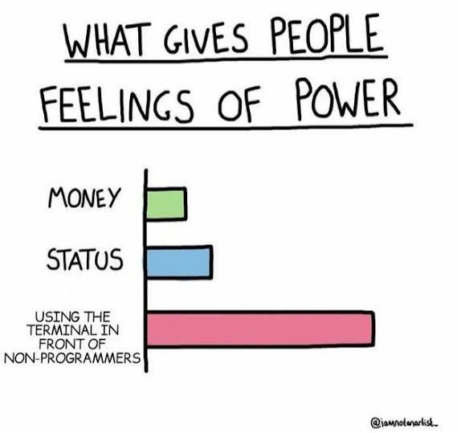

So... What is the terminal?
==========================

Great question!
The terminal is the primary method for interacting with your computer. It has a few differences from how you probably use your computer

<!-- pause -->

1. No GUI, just text (mostlyish)

<!-- pause -->

2. No windows

<!-- pause -->

3. One program at a time (unless you have a program that lets you run multiple programs)

<!-- pause -->

4. Makes you look cooler

<!-- column_layout: [1, 2, 1] -->

<!-- column: 1 -->

<!-- end_slide -->

And we care... why?
===================

Another great question!
The terminal offers quire a few advantages over your fancy desktop environment
Nameably:

<!-- pause -->
 * User interfaces are multiplatform

<!-- pause -->
 * Everything is 🚀Blazingly Fast🚀

<!-- pause -->
 * Insanely configurable

<!-- pause -->
 * Again, just looks cooler

<!-- pause -->
 * Feel a real sense of control over you computer

<!-- pause -->
 * A whole lot more fun

<!-- end_slide -->

Things You Probably Need to Know First
======================================

## Paths

A **Path** is how you locate something on your system. But they're more complicated than you think.

`/` simplifies to the root of the filesystem which contains a bunch of random stuff that doesn't matter right now.

`..` simplifies to going one directory back (directory1/directory2/.. goes to directory1

`~` simplifies to `/Users/[Your Name Here]`

`.` simplifies to your working directory

<!-- pause -->

## Working Directory

Your **Working Directory** is the directory you are "in". It's much easier to access files in your working directory.

When you open your terminal, your working directory will almost certainly be `~`

Any path that doesn't start with `~` or `/` is appended to your working directory and is called a relative path ([Working Directory]/[Relative Path])

<!-- end_slide -->

And Some More
=============

## Common Directores

`/Users/` contains all of the users as directories

`~/Downloads` contains your downloads, you can easily access this one in finder

`/bin/` contains many common terminal commands

<!-- end_slide -->

The Basics: Essential Commands
==============================

Every program you run in the terminal is run through a command, usually referencing a file. That file is something called a binary, or executable file. Binaries normally have no file extension (Ex: .png, .jpeg, .jar).

The two most basic commands are `cd` and `ls`

`cd` stands for "change directory", and simply changes the working directory.

But how do you know the contents of your working directory?

`ls`, short for list, lists all of the files and directories in your working directory!

<!-- pause -->

## Try it out!

Open your computer, and open the default terminal app. Try running `ls`. Do you see your downloads folder? `cd` into it! List the files in there! Now cd into your root directory (`cd /`). What directories do you see?

Just these basic commands have already opened up your entire computer's filesystem to explore.

<!-- pause -->

Now close your computer again

<!-- end_slide -->

Running Binaries
================

I mean, you just type the command and the terminal magically does the thing! Except, not really. Well maybe you can only run commands in the `/bin/` directory. Also nope.

Before we learn why this is, let's discuss **Environment Variables**. Environment variables are variables that any program can access. They only last for one terminal session, so closing and reopening the terminal app will cause them to disapear.

You can see a list of environment variables in your terminal by typing another command `env`.

<!-- pause -->

One important env variable is `$PATH`. `$PATH` contains a list of directories that your computer looks in to find commands. This contains directories like `/bin/`, `/sbin/`, and `/opt/homebrew/bin/` (we'll discuss that later).

But if your computer looks there to find binaries, how do you run a binary in your current directory? All you have to do is let your computer know that it's a path by either specifying the full path of the binary, or just typing `./binary`.

<!-- end_slide -->

Program Inputs
==============

## Arguments

Remember earlier when we learned about `cd`? As you may recall, you have to pass a path to it. That's one example of an **Argument**. Arguments can be implied as well, like in the case of `ls`. `ls` can also take a path as input and list the files there, but if you don't provide a path, it assumes the path you want is `.` (your working directory). Arguments can come in any shape or form.

<!-- pause -->

## Flags

Flags are normally put before arguments and look like either `--flag` or `-f`. Flags can also take inputs, like `--flag flag-input` or `-f=flag-input`. We haven't used any commands with flags yet, so lets explore the flags of `ls`. `ls` has more than 30 flags, but let's try the recursive one.

Try typing `ls -R` in a directory. You probably won't be able to read the output because it's going so fast, and if you ran the command in a directory with a lot of other directories (like `~` or, in the worst case, `/`).

<!-- pause -->

**_TIP_**: Press `Ctrl + C` to end the execution of the current program.

<!-- end_slide -->

More Fun Commands
=================

So far you're able to view the structure of your filesystem, but you still can't read or mutate actual files. Let's fix that.

The `cat` command does exactly what you think it does. Outputs the contents of a file in text. It takes the argument of a path to a file. Do this to a non-text file, and you'll get a nice smattering of �s and maybe random Mandarin characters. That's because the file wasn't meant to be read as a text file, but you did it anyway.

The `mkdir` command creates a directory. It takes the name of the directory as an input.

The `touch` command create a file, taking its name as an input.

The `rm` command removes a file, and the `rmdir` command removes a directory

Now we can read (mostly) any file, and interact with the file structure! We can't modify files yet, but we'll get to that soon.

